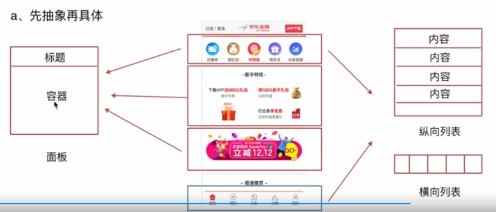

# 组件化设计

## 项目设计与原理分析
### CSS模块化设计-设计原则
> - 1.可复用、能继承、要完整
> - 2.周期性迭代
### CSS模块化设计-设计方法
> - 1.先整体后部分再颗粒化(布局 -> 页面 -> 功能 -> 业务)
> - 2.先抽象再具体
> - 
> - 
### JS组价你设计-设计原则
> - 高内聚低耦合
> - a.先整体后部分再颗粒化
> - b.尽可能的抽象

## 常见问题汇总
1.CSS Module 和 Vue中stype的 scoped 属性有啥异同？
```
相同点
  两者都是为了解决 CSS 类名相互干扰的问题，也就是大家常说的“作用域”问题。使用两种方案都可以达到类似效果，但是两者的区别也很明显。
不同点
  1. CSS Module 是所有组件化框架都支持的技术方案，他不属于某个框架的私有属性。而 scoped 是 Vue 框架的私有属性。
  2. CSS Module 的工作原理直白的讲就是把一个类名做 md5 ，然后在引用的时候直接使用 md5 字符串，进而保证相同的类名根据不同的路径和组件名称得到不同的 md5 值，保证了最终的类名隔离。而 scoped 的做法是做命名空间限制，也就是说每个组件就是一个命名空间，每个命名空间拥有不同的类名（md5）,然后每个下面的类名都会挂在这个命名空间下进而达到隔离。
  3. 对于父组件声明的类名，在子组件内，CSS Module 是不处理的，想用必须显示调用类名($style.类名)，而使用了 scoped 的因为是命名空间的方式，所以子组件依然有效。
```